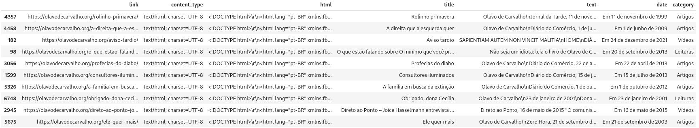

# OlavoDeCarvalho.org

Extração de todas as páginas do site olavodecarvalho.org realizada em 18/03/2025.

## Escopo

O presente repositório trata de um projeto python simples que tem por objetivo colher todos os links possíveis do site olavodecarvalho.org e extrair o conteúdo html correspondente. Há um pré-processamento do título, texto, data e categoria, coforme o seguinte exemplo:



## Dependências

```Python
pip install -r requirements.txt
```

## Resultado

O resultado da extração está salvo no formato parquet: olavodecarvalho_org.parquet